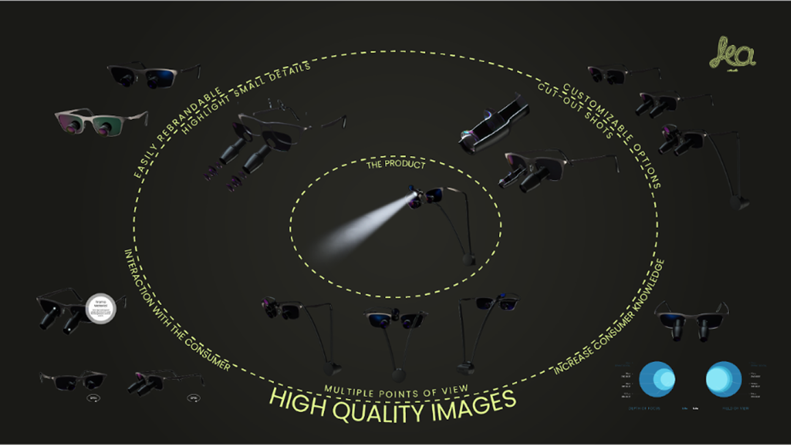

<!-- _class: selected-1 layout-1 menu-list-->

::: grid

+++grid-item

0. Introduction
1. Business Objectives
2. Solution Overview
3. Research
4. User Experience
5. Wireframe
6. Content Gathering
7. 3D and Quality Imagery
8. Branding and UI - Style, Feel & Mock-Ups
9. Development
10. SEO
11. Analytics
12. Live Chat
13. Delivery
14. Maintenance
15. Conclusions

+++

+++grid-item

# Business Objectives

An informationally rich and visually engaging website would help RDDS achieve its business objectives:
1\. Bring across the capability of the company to perform as a ‘big player’ and provide bespoke quality products in an international markets despite being seen as a UK specialist.
2\. Expand business to the land and sea markets.
+++

+++grid-item

<!-- placeholder for image? -->

![bg-placeholder]
+++
:::

---

## <!-- ===== BUSINESS OBJECTIVES ===== -->

<!-- _class: selected-1 wide -->

0. Introduction
1. Business Objectives
2. Solution Overview
3. Research
4. User Experience
5. Wireframe
6. Content Gathering
7. 3D and Quality Imagery
8. Branding and UI - Style, Feel & Mock-Ups
9. Development
10. SEO
11. Analytics
12. Live Chat
13. Delivery
14. Maintenance
15. Conclusions

# Business Objectives

An informationally rich and visually engaging website would help RDDS achieve its business objectives:

1\. Bring across the capability of the company to perform as a ‘big player’ and provide bespoke quality products in an international markets despite being seen as a UK specialist.
2\. Expand business to the land and sea markets.

<!-- placeholder for image? -->

---

## <!-- ===== SOLUTION OVERVIEW ===== -->

<!-- _class: selected-2 layout-column set-image-margin-->

0. Introduction
1. Business Objectives
2. Solution Overview
3. Research
4. User Experience
5. Wireframe
6. Content Gathering
7. 3D and Quality Imagery
8. Branding and UI - Style, Feel & Mock-Ups
9. Development
10. SEO
11. Analytics
12. Live Chat
13. Delivery
14. Maintenance
15. Conclusions

# Solution Overview

A custom tailored website should act as a key tool, a facilitator for communicating about quality bespoke products and capabilities as an experienced manufacturer to a new audience for Sea and Land markets, while maintaining the strong Aerospace market presence.

To achieve this, the website should:
1\. Present the product portfolio in an engaging manner that will entice users to spend time on the website through a ‘product configurator’, thus acting as an interactive product showcase tool.
2\. Enable the company to capture leads and data in order to tailor their digital marketing strategy and increase sales.
3\. Enable the team to easily update the website content in a timely manner (i.e. implement a CMS).
4\. Be a robust SEO-tailored site that acts as an awareness tool to successfully bring across the RDDS brand, product qualities and value proposition.

---

## <!-- ===== RESEARCH 1 ===== -->

<!-- _class: wide menu-extended inner-sel-1-->

0. Introduction
1. Business Objectives
2. Solution Overview
3. Research
   - RDDS Team
   - RDDS Target Market
   - RDDS Competition
4. User Experience
5. Wireframe
6. Content Gathering
7. 3D and Quality Imagery
8. Branding and UI - Style, Feel & Mock-Ups
9. Development
10. SEO
11. Analytics
12. Live Chat
13. Delivery
14. Maintenance
15. Conclusions

# Research - Team

This is the first phase of the process. Here we will assess key information in order to better understand what the company offers and stands for, along with accessing crucial industry knowledge.

### Research on Product Range and Industry:

\- ‘Meet’ the team - get information on employees and relevant internal processes

\- Understand and document manufacturing processes

\- Understand and document products and product categories (e.g. which are the best selling products?)

### Research on the Visual and Feel:

\- Access and assess brandbook/styleguide to get a general feel of the brand style and its values

\- Access and assess current visual/text assets

<!-- placeholder for image? -->

---

## <!-- ===== RESEARCH 2 ===== -->

<!-- _class: wide menu-extended inner-sel-2-->

0. Introduction
1. Business Objectives
2. Solution Overview
3. Research
   - RDDS Team
   - RDDS Target Market
   - RDDS Competition
4. User Experience
5. Wireframe
6. Content Gathering
7. 3D and Quality Imagery
8. Branding and UI - Style, Feel & Mock-Ups
9. Development
10. SEO
11. Analytics
12. Live Chat
13. Delivery
14. Maintenance
15. Conclusions

# Research

In order to better understand the user (their preferences and their journey on the website), we will outline a few user personas and simulate their information seeking process on the RDDS website. This knowledge will enable us to build a website that caters to every customer profile (in terms of communication style and information quantity and organisation), thus improving conversion rates.

Which are the three most important segments that purchase most often?
Who do they work for/what organisation do they represent?
How many actions need to be taken or how much time do customers need to make a purchase?
Can we make the website’s structure cut down some of these steps (i.e. implementing a configurator that helps the user build a better understanding of the product range)?

There's also two main relevant groups that should be taken into consideration:
Knowledgeable (i.e. integrators)
Less knowledgeable (i.e. procurement)

<!-- placeholder for image? -->

---

## <!-- ===== UX 1 ===== -->

<!-- _class: wide menu-extended inner-sel-1-->

0. Introduction
1. Business Objectives
2. Solution Overview
3. Research
4. User Experience
   - Sitemap
   - User Scenarios
5. Wireframe
6. Content Gathering
7. 3D and Quality Imagery
8. Branding and UI - Style, Feel & Mock-Ups
9. Development
10. SEO
11. Analytics
12. Live Chat
13. Delivery
14. Maintenance
15. Conclusions

# UX - Sitemap

A sitemap will flesh out the website’s structure while taking into consideration the potential use cases and the specific purpose for each page.

The sitemap will help us organise the content on the actual website and will provide a clear structure for the search engine crawlers to go through (i.e. SEO benefit).

Deliverable: A flowchart that describes the website pages and the user flow.

At this point we will organise a feedback session to discuss the sitemap.

<!-- placeholder for image? -->

---

## <!-- ===== UX 2 ===== -->

<!-- _class: wide inner-sel-2-->

0. Introduction
1. Business Objectives
2. Solution Overview
3. Research
4. User Experience
   - Sitemap
   - User Scenarios
5. Wireframe
6. Content Gathering
7. 3D and Quality Imagery
8. Branding and UI - Style, Feel & Mock-Ups
9. Development
10. SEO
11. Analytics
12. Live Chat
13. Delivery
14. Maintenance
15. Conclusions

# UX - Scenarios

With the information gathered during the Target Market Research phase, we will do a series of simulations to better understand what those customer profiles would look for on the website and how long would it take them to reach their goal.

In order to build a smooth user journey, we must make sure the website will efficiently guide the user towards conversion, while also receiving all the relevant information they need.

Deliverable: a set of scenarios

<!-- placeholder for image? -->

---

## <!-- ===== WIREFRAME ===== -->

<!-- _class: wide selected-5 -->

0. Introduction
1. Business Objectives
2. Solution Overview
3. Research
4. User Experience
5. Wireframe
6. Content Gathering
7. 3D and Quality Imagery
8. Branding and UI - Style, Feel & Mock-Ups
9. Development
10. SEO
11. Analytics
12. Live Chat
13. Delivery
14. Maintenance
15. Conclusions

# Wireframe

Building on the sitemap, a wireframe organises the general content items on each page. It fleshes out the type, quantity and position of images, texts, buttons and other elements on each page. This is indicative of the quantity of information needed and its hierarchy of importance.

Deliverable: a Figma file showcasing the wireframe

At this point we will organise a feedback session to discuss the wireframe.

<!-- placeholder for image? -->

---

## <!-- ===== CONTENT GATHERING ===== -->

<!-- _class: wide selected-6 -->

0. Introduction
1. Business Objectives
2. Solution Overview
3. Research
4. User Experience
5. Wireframe
6. Content Gathering
7. 3D and Quality Imagery
8. Branding and UI - Style, Feel & Mock-Ups
9. Development
10. SEO
11. Analytics
12. Live Chat
13. Delivery
14. Maintenance
15. Conclusions

# Content Gathering

At this stage we should have a solid idea of what the RDDS and its website should look and feel like, based on the materials obtained and research performed during the initial phases.

We can offer consultancy in terms of ‘look’, ‘feel’, branding under the form of general guidelines.

We will select the materials that would be suitable for implementation on the website. Our team will alter and improve the text content according to SEO principles and research.

At this point, we will arrange a feedback session to discuss the content we've curated.

<!-- placeholder for image? -->

---

## <!-- ===== Quality Visuals - Customer Effect ===== -->

<!-- _class: average inner-sel-1 -->

0. Introduction
1. Business Objectives
2. Solution Overview
3. Research
4. User Experience
5. Wireframe
6. Content Gathering
7. 3D and Quality Imagery
   - Customer Effect
   - Visual Opportunities
   - Brand Benefits
8. Branding and UI - Style, Feel & Mock-Ups
9. Development
10. SEO
11. Analytics
12. Live Chat
13. Delivery
14. Maintenance
15. Conclusions

# Quality Visuals - Customer Effect

3D images can attract customers who are looking for the highest possible quality or unique elements of craftsmanship. The realistic imagery is an important addition that engages customers who don't have the opportunity to closely examine a physical product or prototype. A set of photorealistic images that walk a customer through a brand’s engineering process can provide an informative comparison of several products in a collection.

### Cut-out images

3D rendering removes the necessity of building a separate prototype just to break it down to showcase the product’s inner workings. Cut-out images lend a sense of transparency to a marketing campaign and allow potential buyers to explore the intricacies of a product.

### Multiple points of view

Creating multiple points of view places a consumer in a setting where they can easily engage with the product. Customers can scroll through and evaluate different versions of a product until they find an option that meets their criteria.

### Freedom of exploration

Interactive 3D product experiences provide consumers with the freedom to explore products online as though they were in a store, while getting direct access to enriched content and customization capabilities. Most importantly, it can instill a sense of ownership even before interaction with a physical product takes place.

<!-- placeholder for image? -->

---

## <!-- ===== Quality Visuals - OPPORTUNITIES ===== -->

<!-- _class: average inner-sel-2 layout-column image-center-->

0. Introduction
1. Business Objectives
2. Solution Overview
3. Research
4. User Experience
5. Wireframe
6. Content Gathering
7. 3D and Quality Imagery
   - Customer Effect
   - Visual Opportunities
   - Brand Benefits
8. Branding and UI - Style, Feel & Mock-Ups
9. Development
10. SEO
11. Analytics
12. Live Chat
13. Delivery
14. Maintenance
15. Conclusions

# Quality Visuals - Variation Opportunities

---

## <!-- ===== Quality Visuals - BRAND BENEFITS ===== -->

<!-- _class: inner-sel-3 medium -->

0. Introduction
1. Business Objectives
2. Solution Overview
3. Research
4. User Experience
5. Wireframe
6. Content Gathering
7. 3D and Quality Imagery
   - Customer Effect
   - Visual Opportunities
   - Brand Benefits
8. Branding and UI - Style, Feel & Mock-Ups
9. Development
10. SEO
11. Analytics
12. Live Chat
13. Delivery
14. Maintenance
15. Conclusions

# Quality Visuals - Brand Benefits

Increases and improves the visual communication
Easily shows concepts and options for a product
Display of customized products
Show product from any angle possible
Go into details that are impossible to show with photography or film
Precise and accurate renderings
Environment control
Easy to distribute
Visitors engagement
Set products apart from competition

 class='image__container'

<!-- placeholder for image? -->

---

## <!-- ===== BRANDING ===== -->

<!-- _class: selected-8 medium -->

0. Introduction
1. Business Objectives
2. Solution Overview
3. Research
4. User Experience
5. Wireframe
6. Content Gathering
7. 3D and Quality Imagery
8. Branding and UI - Style, Feel & Mock-Ups
9. Development
10. SEO
11. Analytics
12. Live Chat
13. Delivery
14. Maintenance
15. Conclusions

# Branding and UI - Style, Feel & Mock-Ups

Here we take a closer look at the visual elements (sliders, buttons, actual images and interaction design).

Deliverable 1 - mock-up for the homepage which should indicate the general feel of the website.

After we agree upon the first page, we'll prepare the second deliverable:

Deliverable 2 - perform requested modifications and proceed to create the design for the remaining pages and then adapt all pages to the mobile version

We will organise a feedback session on the materials provided at this stage.

KPIs: Time Spent on Page, Time Required to Complete a Task (this should be reduced),

 class='image__container'

<!-- placeholder for image? -->

---

## <!-- ===== DEVELOPMENT ===== -->

<!-- _class: selected-9 small -->

0. Introduction
1. Business Objectives
2. Solution Overview
3. Research
4. User Experience
5. Wireframe
6. Content Gathering
7. 3D and Quality Imagery
8. Branding and UI - Style, Feel & Mock-Ups
9. Development
10. SEO
11. Analytics
12. Live Chat
13. Delivery
14. Maintenance
15. Conclusions

# Development

At this stage we will perform the basic technical SEO optimisation. This includes measures that affect the general readability of the content, implementing meta-tags, image tags and Robots.txt, implementing correct headings (i.e. h1, h2).

These initial actions will ensure the website is accessible to and indexed by search engines by also optimising the crawling process.

Furthermore, we'll set and optimise the website for different devices and the page loading speeds.

For this type of activity we use multiple tools from Google’s Page Speed Insights to Sonar and GT Metrix.

# Analytics: GA and Hotjar

After the website is live and kicking, we'll implement a series of analytics tools that will help us keep an eye on page loading speeds, user behaviour, traffic and other key metrics. For this purpose we'll implement:

Google Analytics: real-time information on user activity, devices, locations and bounce rates.

HotJar: a tool that shows us exactly what users are doing on the website, what they click, what they think they can click and how long down a page they go before losing interest

These tools will help with identifying certain KPIs:
Average Order Amount
Revenue
Number of conversions
Product performance
Awareness level (traffic sources, surveying users)
Lead Conversion Rate (configure goals in GA)

We are well versed in building GDPR-compliant data capturing methods on websites.

 class='image__container'

<!-- placeholder for image? -->

---

## <!-- ===== ANALYTICS ===== -->

<!-- _class: inner-sel-2 medium -->

0. Introduction
1. Business Objectives
2. Solution Overview
3. Research
4. User Experience
5. Wireframe
6. Content Gathering
7. 3D and Quality Imagery
8. Branding and UI - Style, Feel & Mock-Ups
9. Development
10. SEO
11. Analytics
    - GA and HotJar
    - AlbaCross and LeadWorx
12. Live Chat
13. Delivery
14. Maintenance
15. Conclusions

# Analytics - AlbaCross and LeadWorx

As per the information in the documents supplied, an important factor is discovering who are the potential users that visit the website.

There are some alternatives for this, but more widely know are AlbaCross and LeadWorx.

We connect the tools in the backend and using a database and geo-tracking (i.e. where the users are based - country, city) then try to pinpoint the location/company of the visitors.

This is especially valuable if RDDS is considering cold outreach, as there is a high probability that visitors are looking for a supplier or researching.

 class='image__container'

<!-- placeholder for image? -->

---

## <!-- ===== SEO 1 ===== -->

<!-- _class: inner-sel-1 medium -->

0. Introduction
1. Business Objectives
2. Solution Overview
3. Research
4. User Experience
5. Wireframe
6. Content Gathering
7. 3D and Quality Imagery
8. Branding and UI - Style, Feel & Mock-Ups
9. Development
10. SEO
    - Research
    - Backlinking
11. Analytics
12. Live Chat
13. Delivery
14. Maintenance
15. Conclusions

# SEO - Research

The SEO process begins by performing research on the competition and the RDDS online presence. This means analysing the keywords used to look for the industry's products, their difficulty, search volumes, domains trustworthiness and backlinks. In order to do this, we'll take a look at Google rankings, backlinks and Google trends.

AHREFS is a complete SEO tool which allows us to perform domain analysis (identify backlinks and assess the domain's trustworthiness). In order to assess search volumes we'll also use AHREFS along with other similar tools such as BlogBing or UberSuggest.

With this data we can identify the competition's rankings, underused keywords as well as the more competitive keywords. This way we can pin point opportunities such as relevant keywords that are not exploited by the competition.

KPI: The success of our SEO strategy will be measured by the number of backlinks, the domain and keywords rankings.

 class='image__container'

<!-- placeholder for image? -->

---

## <!-- ===== SEO 2 ===== -->

<!-- _class: inner-sel-2 medium -->

0. Introduction
1. Business Objectives
2. Solution Overview
3. Research
4. User Experience
5. Wireframe
6. Content Gathering
7. 3D and Quality Imagery
8. Branding and UI - Style, Feel & Mock-Ups
9. Development
10. SEO
    - Research
    - Backlinking
11. Analytics
12. Live Chat
13. Delivery
14. Maintenance
15. Conclusions

# SEO - Backlinking

Backlinks should be natural, this means that a website must not use artificial ways to create backlinks for their own websites. The quality of links is far more important than the quantity.

We recommend backlinking as one of the first SEO task to start as the results take much time to appear (from 4 to 6 months).

We recommend to start with industry websites and directories that allow adding of companies.

In this case, we use AHREFS to discover backlinks and then start creating profiles to gain links on various websites.

We do recommend that once the number of backlinks in your field has run out, to review this part of the SEO strategy (maybe with link building via content).

KPIs: Domain Trustworthiness, Number of Backlinks, Keyword rankings

 class='image__container'

<!-- placeholder for image? -->

---

## <!-- LIVE CHAT -->

<!-- class: narrow selected-12 -->

0. Introduction
1. Business Objectives
2. Solution Overview
3. Research
4. User Experience
5. Wireframe
6. Content Gathering
7. 3D and Quality Imagery
8. Branding and UI - Style, Feel & Mock-Ups
9. Development
10. SEO
11. Analytics
12. Live Chat
13. Delivery
14. Maintenance
15. Conclusions

# Add-on Recommendation - Live Chat

To help with lead capturing and to serve as an additional source for analytics, we recommend implementing a live chat widget (controlled and monitored by your sales team).
Live chat services such as Intercom are solutions for:

Showcasing Great and Prompt Support Services
Data Capture
Lead Funneling

The live chat solutions are an efficient lead capturing tactic, as it can generate 20% more leads than Marketing Qualified Leads (on a monthly basis). Moreover, they have a positive impact on conversion rates, as users are 82% more likely to purchase if they’ve chatted with you in real time first.

You control the flow. The first few replies can be automatised and you can choose where the widget appears on the website (i.e. which pages are most likely to convert).

KPIs: Number of qualified leads, Sales conversion rate, Sales team satisfaction (assessed through questionnaires), Time spent to complete sales tasks,

 class='image__container'

<!-- placeholder for image? -->

---

## <!-- =====  DELIVERY ===== -->

<!-- _class: selected-13 medium -->

0. Introduction
1. Business Objectives
2. Solution Overview
3. Research
4. User Experience
5. Wireframe
6. Content Gathering
7. 3D and Quality Imagery
8. Branding and UI - Style, Feel & Mock-Ups
9. Development
10. SEO
11. Analytics
12. Live Chat
13. Delivery
14. Maintenance
15. Conclusions

# Delivery

 class='image__container'

<!-- placeholder for image? -->

---

## <!-- ===== CONCLUSIONS ===== -->

<!-- _class: selected-15 medium -->

0. Introduction
1. Business Objectives
2. Solution Overview
3. Research
4. User Experience
5. Wireframe
6. Content Gathering
7. 3D and Quality Imagery
8. Branding and UI - Style, Feel & Mock-Ups
9. Development
10. SEO
11. Analytics
12. Live Chat
13. Delivery
14. Maintenance
15. Conclusions

# Conclusions

 class='image__container'

<!-- placeholder for image? -->

