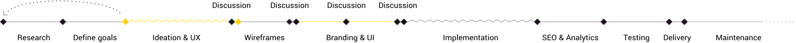

<!-- header -->

    

<!-- side bit - repeated many times - change the seleceted on each slide -->

    <!-- menu -->
    <ul class= 'menu'>
        <li class='menu__item'>
            0
            

            Introduction

        </li>
        <li class='menu__current'>
            1
            

            Business Objectives

            
        </li>
        <li class='menu__item'>
            2
Solution Overview

        </li>
        <li class='menu__item'>
            3
Research

        </li>
        <li class='menu__item'>
            4
User Experience

        </li>
        <li class='menu__item'>
            5
Wireframe

        </li>
        <li class='menu__item'>
            6
Content Gathering

        </li>
        <li class='menu__item'>
            7
3D and Quality Imagery

        </li>
        <li class='menu__item'>
            8
Branding and UI - Style, Feel & Mock-Ups 

        </li>
        <li class='menu__item'>
            9
Development

        </li>
        <li class='menu__item'>
            10
SEO

        </li>
        <li class='menu__item'>
            11
Analytics

        </li>
        <li class='menu__item'>
            12
Live Chat

        </li>
        <li class='menu__item'>
            13
Delivery

        </li>
        <li class='menu__item'>
            14
Maintenance

        </li>
        <li class='menu__item'>
            15
Conclusions

        </li>
    </ul>
    <!-- content -->
    

        <h1>Business Objectives</h1>
        

            
An informationally rich and visually engaging website would help RDDS achieve its business objectives:

            
 1. Bring across the capability of the company to perform as a ‘big player’ and provide bespoke quality products in an international markets despite being seen as a UK specialist.

            
 2. Expand business to the land and sea markets.

        

    

    

<!-- footer -->

    
KAPPA / LONDON 

    
x RDDS 

---

<!-- header -->

    

    
 <!-- menu -->
 <ul class= 'menu'>
        <li class='menu__item'>
            0
            

            Introduction

        </li>
        <li class='menu__item'>
            1
            

            Business Objectives

        </li>
        <li class='menu__current'>
            2
Solution Overview

             
        </li>
        <li class='menu__item'>
            3
Research

        </li>
        <li class='menu__item'>
            4
User Experience

        </li>
        <li class='menu__item'>
            5
Wireframe

        </li>
        <li class='menu__item'>
            6
Content Gathering

        </li>
        <li class='menu__item'>
            7
3D and Quality Imagery

        </li>
        <li class='menu__item'>
            8
Branding and UI - Style, Feel & Mock-Ups 

        </li>
        <li class='menu__item'>
            9
Development

        </li>
        <li class='menu__item'>
            10
SEO

        </li>
        <li class='menu__item'>
            11
Analytics

        </li>
        <li class='menu__item'>
            12
Live Chat

        </li>
        <li class='menu__item'>
            13
Delivery

        </li>
        <li class='menu__item'>
            14
Maintenance

        </li>
        <li class='menu__item'>
            15
Conclusions

        </li>
    </ul>

<!-- content -->

 

    <h1>Solution Overview
    </h1>
    

            
A custom tailored website should act as a key tool, a facilitator for communicating about quality bespoke products and capabilities as an experienced manufacturer to a new audience for Sea and Land markets, while maintaining the strong Aerospace market presence.
            

            
 To achieve this, the website should: 
            1. Present the product portfolio in an engaging manner that will entice users to spend time on the website through a ‘product configurator’, thus acting as an interactive product showcase tool.
             2. Enable the company to capture leads and data in order to tailor their digital marketing strategy and increase sales.
             3. Enable the team to easily update the website content in a timely manner (i.e. implement a CMS).
             4. Be a robust SEO-tailored site that acts as an awareness tool to successfully bring across the RDDS brand, product qualities and value proposition.

    

 

    

<!-- footer -->

    
KAPPA / LONDON 

    
x RDDS 

