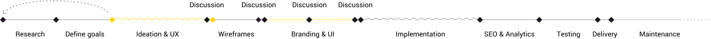

<!-- ===== BUSINESS OBJECTIVES ===== -->

<!-- header -->

    

<!-- side bit - repeated many times - change the seleceted on each slide -->

    <!-- menu -->
    <ul class= 'menu'>
        <li class='menu__item'>
            0
            

            Introduction

        </li>
        <li class='menu__current'>
            1
            

            Business Objectives

            
        </li>
        <li class='menu__item'>
            2
Solution Overview

        </li>
        <li class='menu__item'>
            3
Research

        </li>
        <li class='menu__item'>
            4
User Experience

        </li>
        <li class='menu__item'>
            5
Wireframe

        </li>
        <li class='menu__item'>
            6
Content Gathering

        </li>
        <li class='menu__item'>
            7
3D and Quality Imagery

        </li>
        <li class='menu__item'>
            8
Branding and UI - Style, Feel & Mock-Ups 

        </li>
        <li class='menu__item'>
            9
Development

        </li>
        <li class='menu__item'>
            10
SEO

        </li>
        <li class='menu__item'>
            11
Analytics

        </li>
        <li class='menu__item'>
            12
Live Chat

        </li>
        <li class='menu__item'>
            13
Delivery

        </li>
        <li class='menu__item'>
            14
Maintenance

        </li>
        <li class='menu__item'>
            15
Conclusions

        </li>
    </ul>
    <!-- content -->
    

    

        <h1>Business Objectives</h1>
        

            
An informationally rich and visually engaging website would help RDDS achieve its business objectives:

            
 1. Bring across the capability of the company to perform as a ‘big player’ and provide bespoke quality products in an international markets despite being seen as a UK specialist.

            
 2. Expand business to the land and sea markets.

        

    

    

    

<!-- footer -->

    
KAPPA / LONDON 

    
x RDDS 

---

<!-- ===== SOLUTION OVERVIEW ===== -->

<!-- header -->

    

    
 <!-- menu -->
 <ul class= 'menu'>
        <li class='menu__item'>
            0
            

            Introduction

        </li>
        <li class='menu__item'>
            1
            

            Business Objectives

        </li>
        <li class='menu__current'>
            2
Solution Overview

             
        </li>
        <li class='menu__item'>
            3
Research

        </li>
        <li class='menu__item'>
            4
User Experience

        </li>
        <li class='menu__item'>
            5
Wireframe

        </li>
        <li class='menu__item'>
            6
Content Gathering

        </li>
        <li class='menu__item'>
            7
3D and Quality Imagery

        </li>
        <li class='menu__item'>
            8
Branding and UI - Style, Feel & Mock-Ups 

        </li>
        <li class='menu__item'>
            9
Development

        </li>
        <li class='menu__item'>
            10
SEO

        </li>
        <li class='menu__item'>
            11
Analytics

        </li>
        <li class='menu__item'>
            12
Live Chat

        </li>
        <li class='menu__item'>
            13
Delivery

        </li>
        <li class='menu__item'>
            14
Maintenance

        </li>
        <li class='menu__item'>
            15
Conclusions

        </li>
    </ul>

<!-- content -->

 

    <h1>Solution Overview
    </h1>
    

            
A custom tailored website should act as a key tool, a facilitator for communicating about quality bespoke products and capabilities as an experienced manufacturer to a new audience for Sea and Land markets, while maintaining the strong Aerospace market presence.
            

            
 To achieve this, the website should: 
            1. Present the product portfolio in an engaging manner that will entice users to spend time on the website through a ‘product configurator’, thus acting as an interactive product showcase tool.
             2. Enable the company to capture leads and data in order to tailor their digital marketing strategy and increase sales.
             3. Enable the team to easily update the website content in a timely manner (i.e. implement a CMS).
             4. Be a robust SEO-tailored site that acts as an awareness tool to successfully bring across the RDDS brand, product qualities and value proposition.

    

 

    

<!-- footer -->

    
KAPPA / LONDON 

    
x RDDS 

---

<!-- ===== RESEARCH ===== -->

<!-- header -->

    
    

    
 <!-- menu -->
 <ul class= 'menu'>
        <li class='menu__item'>
            0
            

            Introduction

        </li>
        <li class='menu__item'>
            1
            

            Business Objectives

        </li>
        <li class='menu__item'>
            2
Solution Overview

        </li>
          <li class='menu__current'>
            3
Research

               
        </li>
        <!-- inner list -->
            <ul class="menu__inner-list">
                <li class='menu__text menu__text--selected'>RDDS Team</li>
                <li class='menu__text'>RDDS Target Market</li>
                <li class='menu__text'>RDDS Competition</li>
            </ul>
        <li class='menu__item'>
            4
User Experience

        </li>
        <li class='menu__item'>
            5
Wireframe

        </li>
        <li class='menu__item'>
            6
Content Gathering

        </li>
        <li class='menu__item'>
            7
3D and Quality Imagery

        </li>
        <li class='menu__item'>
            8
Branding and UI - Style, Feel & Mock-Ups 

        </li>
        <li class='menu__item'>
            9
Development

        </li>
        <li class='menu__item'>
            10
SEO

        </li>
        <li class='menu__item'>
            11
Analytics

        </li>
        <li class='menu__item'>
            12
Live Chat

        </li>
        <li class='menu__item'>
            13
Delivery

        </li>
        <li class='menu__item'>
            14
Maintenance

        </li>
        <li class='menu__item'>
            15
Conclusions

        </li>
    </ul>

<!-- content -->

   

        <h1>Research</h1>
        

               
This is the first phase of the process. Here we will assess key information in order to better understand what the company offers and stands for, along with accessing crucial industry knowledge. 

**Research on Product Range and Industry:**

- ‘Meet’ the team - get information on employees and relevant internal processes

- Understand and document manufacturing processes

- Understand and document products and product categories (e.g. which are the best selling products?)

**Research on the Visual and Feel:**

- Access and assess brandbook/styleguide to get a general feel of the brand style and its values

- Access and assess current visual/text assets

        

    

    

 

<!-- footer -->

    
KAPPA / LONDON 

    
x RDDS 

---

<!-- ==== RESEARCH 2 ===== -->

<!-- header -->

    
    

    
 <!-- menu -->
 <ul class= 'menu'>
        <li class='menu__item'>
            0
            

            Introduction

        </li>
        <li class='menu__item'>
            1
            

            Business Objectives

        </li>
        <li class='menu__item'>
            2
Solution Overview

        </li>
          <li class='menu__current'>
            3
Research

               
        </li>
         <!-- inner list -->
            <ul class="menu__inner-list">
                <li class='menu__text'>RDDS Team</li>
                <li class='menu__text menu__text--selected'>RDDS Target Market</li>
                <li class='menu__text'>RDDS Competition</li>
            </ul>
        <li class='menu__item'>
            4
User Experience

        </li>
        <li class='menu__item'>
            5
Wireframe

        </li>
        <li class='menu__item'>
            6
Content Gathering

        </li>
        <li class='menu__item'>
            7
3D and Quality Imagery

        </li>
        <li class='menu__item'>
            8
Branding and UI - Style, Feel & Mock-Ups 

        </li>
        <li class='menu__item'>
            9
Development

        </li>
        <li class='menu__item'>
            10
SEO

        </li>
        <li class='menu__item'>
            11
Analytics

        </li>
        <li class='menu__item'>
            12
Live Chat

        </li>
        <li class='menu__item'>
            13
Delivery

        </li>
        <li class='menu__item'>
            14
Maintenance

        </li>
        <li class='menu__item'>
            15
Conclusions

        </li>
    </ul>

<!-- TODO: fix text alignment on this slide -->
<!-- content -->

   

        <h1>Research</h1>
        

                
In order to better understand the user (their preferences and their journey on the website), we will outline a few user personas and simulate their information seeking process on the RDDS website. This knowledge will enable us to build a website that caters to every customer profile (in terms of communication style and information quantity and organisation), thus improving conversion rates.

                
Which are the three most important segments that purchase most often?
                 
                Who do they work for/what organisation do they represent?
                 
                How many actions need to be taken or how much time do customers need to make a purchase?  
                Can we make the website’s structure cut down some of these steps (i.e. implementing a configurator that helps the user build a better understanding of the product range)?

                
There's also two main relevant groups that should be taken into consideration: 
                Knowledgeable (i.e. integrators) 
                Less knowledgeable (i.e. procurement)
                

        

    

    

 

<!-- footer -->

    
KAPPA / LONDON 

    
x RDDS 

---

## <!-- ===== USER EXPERIENCE  1 ===== -->

<!-- header -->

    
    

    
 <!-- menu -->
 <ul class= 'menu'>
        <li class='menu__item'>
            0
            

            Introduction

        </li>
        <li class='menu__item'>
            1
            

            Business Objectives

        </li>
        <li class='menu__item'>
            2
Solution Overview

        </li>
          <li class='menu__item'>
            3
Research

        </li>
        <li class='menu__current'>
            4
User Experience

             
        </li>
        <li class='menu__item'>
            5
Wireframe

        </li>
        <li class='menu__item'>
            6
Content Gathering

        </li>
        <li class='menu__item'>
            7
3D and Quality Imagery

        </li>
        <li class='menu__item'>
            8
Branding and UI - Style, Feel & Mock-Ups 

        </li>
        <li class='menu__item'>
            9
Development

        </li>
        <li class='menu__item'>
            10
SEO

        </li>
        <li class='menu__item'>
            11
Analytics

        </li>
        <li class='menu__item'>
            12
Live Chat

        </li>
        <li class='menu__item'>
            13
Delivery

        </li>
        <li class='menu__item'>
            14
Maintenance

        </li>
        <li class='menu__item'>
            15
Conclusions

        </li>
    </ul>

<!-- content -->

   

        <h1>UX - Sitemap</h1>
        

                
text

        

    

    

 

<!-- footer -->

    
KAPPA / LONDON 

    
x RDDS 

---

## <!-- ===== UX 2 ===== -->

<!-- header -->

    
    

    
 <!-- menu -->
 <ul class= 'menu'>
        <li class='menu__item'>
            0
            

            Introduction

        </li>
        <li class='menu__item'>
            1
            

            Business Objectives

        </li>
        <li class='menu__item'>
            2
Solution Overview

        </li>
          <li class='menu__item'>
            3
Research

        </li>
        <li class='menu__current'>
            4
User Experience

             
        </li>
        <li class='menu__item'>
            5
Wireframe

        </li>
        <li class='menu__item'>
            6
Content Gathering

        </li>
        <li class='menu__item'>
            7
3D and Quality Imagery

        </li>
        <li class='menu__item'>
            8
Branding and UI - Style, Feel & Mock-Ups 

        </li>
        <li class='menu__item'>
            9
Development

        </li>
        <li class='menu__item'>
            10
SEO

        </li>
        <li class='menu__item'>
            11
Analytics

        </li>
        <li class='menu__item'>
            12
Live Chat

        </li>
        <li class='menu__item'>
            13
Delivery

        </li>
        <li class='menu__item'>
            14
Maintenance

        </li>
        <li class='menu__item'>
            15
Conclusions

        </li>
    </ul>

<!-- content -->

   

        <h1>UX - Scenarios</h1>
        

                
text

        

    

    

 

<!-- footer -->

    
KAPPA / LONDON 

    
x RDDS 

---

## <!-- ===== WIREFRAMEs ===== -->

<!-- header -->

    
    

    
 <!-- menu -->
 <ul class= 'menu'>
        <li class='menu__item'>
            0
            

            Introduction

        </li>
        <li class='menu__item'>
            1
            

            Business Objectives

        </li>
        <li class='menu__item'>
            2
Solution Overview

        </li>
          <li class='menu__item'>
            3
Research

        </li>
        <li class='menu__item'>
            4
User Experience

        </li>
        <li class='menu__current'>
            5
Wireframe

              
        </li>
        <li class='menu__item'>
            6
Content Gathering

        </li>
        <li class='menu__item'>
            7
3D and Quality Imagery

        </li>
        <li class='menu__item'>
            8
Branding and UI - Style, Feel & Mock-Ups 

        </li>
        <li class='menu__item'>
            9
Development

        </li>
        <li class='menu__item'>
            10
SEO

        </li>
        <li class='menu__item'>
            11
Analytics

        </li>
        <li class='menu__item'>
            12
Live Chat

        </li>
        <li class='menu__item'>
            13
Delivery

        </li>
        <li class='menu__item'>
            14
Maintenance

        </li>
        <li class='menu__item'>
            15
Conclusions

        </li>
    </ul>

<!-- content -->

   

        <h1>Wireframe</h1>
        

                
text

        

    

    

 

<!-- footer -->

    
KAPPA / LONDON 

    
x RDDS 

---

## <!-- ===== CONTENT GATHERING ===== -->

<!-- header -->

    
    

    
 <!-- menu -->
 <ul class= 'menu'>
        <li class='menu__item'>
            0
            

            Introduction

        </li>
        <li class='menu__item'>
            1
            

            Business Objectives

        </li>
        <li class='menu__item'>
            2
Solution Overview

        </li>
          <li class='menu__item'>
            3
Research

        </li>
        <li class='menu__item'>
            4
User Experience

        </li>
        <li class='menu__item'>
            5
Wireframe

        </li>
        <li class='menu__current'>
            6
Content Gathering

             
        </li>
        <li class='menu__item'>
            7
3D and Quality Imagery

        </li>
        <li class='menu__item'>
            8
Branding and UI - Style, Feel & Mock-Ups 

        </li>
        <li class='menu__item'>
            9
Development

        </li>
        <li class='menu__item'>
            10
SEO

        </li>
        <li class='menu__item'>
            11
Analytics

        </li>
        <li class='menu__item'>
            12
Live Chat

        </li>
        <li class='menu__item'>
            13
Delivery

        </li>
        <li class='menu__item'>
            14
Maintenance

        </li>
        <li class='menu__item'>
            15
Conclusions

        </li>
    </ul>

<!-- content -->

   

        <h1>Content Gathering</h1>
        

                
text

        

    

    

 

<!-- footer -->

    
KAPPA / LONDON 

    
x RDDS 

---

## <!-- ===== 3D AND QUALITY IMAGERY ===== -->

<!-- header -->

    
    

    
 <!-- menu -->
 <ul class= 'menu'>
        <li class='menu__item'>
            0
            

            Introduction

        </li>
        <li class='menu__item'>
            1
            

            Business Objectives

        </li>
        <li class='menu__item'>
            2
Solution Overview

        </li>
          <li class='menu__item'>
            3
Research

        </li>
        <li class='menu__item'>
            4
User Experience

        </li>
        <li class='menu__current'>
            5
Wireframe

              
        </li>
        <li class='menu__item'>
            6
Content Gathering

        </li>
        <li class='menu__item'>
            7
3D and Quality Imagery

        </li>
        <li class='menu__item'>
            8
Branding and UI - Style, Feel & Mock-Ups 

        </li>
        <li class='menu__item'>
            9
Development

        </li>
        <li class='menu__item'>
            10
SEO

        </li>
        <li class='menu__item'>
            11
Analytics

        </li>
        <li class='menu__item'>
            12
Live Chat

        </li>
        <li class='menu__item'>
            13
Delivery

        </li>
        <li class='menu__item'>
            14
Maintenance

        </li>
        <li class='menu__item'>
            15
Conclusions

        </li>
    </ul>

<!-- content -->

   

        <h1>Quality Visuals - Customer Effect
</h1>
        

                
text

        

    

    

 

<!-- footer -->

    
KAPPA / LONDON 

    
x RDDS 

---

<!-- header -->

    
    

    
 <!-- menu -->
 <ul class= 'menu'>
        <li class='menu__item'>
            0
            

            Introduction

        </li>
        <li class='menu__item'>
            1
            

            Business Objectives

        </li>
        <li class='menu__item'>
            2
Solution Overview

        </li>
          <li class='menu__item'>
            3
Research

        </li>
        <li class='menu__item'>
            4
User Experience

        </li>
        <li class='menu__current'>
            5
Wireframe

              
        </li>
        <li class='menu__item'>
            6
Content Gathering

        </li>
        <li class='menu__item'>
            7
3D and Quality Imagery

        </li>
        <li class='menu__item'>
            8
Branding and UI - Style, Feel & Mock-Ups 

        </li>
        <li class='menu__item'>
            9
Development

        </li>
        <li class='menu__item'>
            10
SEO

        </li>
        <li class='menu__item'>
            11
Analytics

        </li>
        <li class='menu__item'>
            12
Live Chat

        </li>
        <li class='menu__item'>
            13
Delivery

        </li>
        <li class='menu__item'>
            14
Maintenance

        </li>
        <li class='menu__item'>
            15
Conclusions

        </li>
    </ul>

<!-- content -->

   

        <h1>Quality Visuals - Variation Opportunities
</h1>
        

                
text

        

    

    

 

<!-- footer -->

    
KAPPA / LONDON 

    
x RDDS 

---

<!-- header -->

    
    

    
 <!-- menu -->
 <ul class= 'menu'>
        <li class='menu__item'>
            0
            

            Introduction

        </li>
        <li class='menu__item'>
            1
            

            Business Objectives

        </li>
        <li class='menu__item'>
            2
Solution Overview

        </li>
          <li class='menu__item'>
            3
Research

        </li>
        <li class='menu__item'>
            4
User Experience

        </li>
        <li class='menu__current'>
            5
Wireframe

              
        </li>
        <li class='menu__item'>
            6
Content Gathering

        </li>
        <li class='menu__item'>
            7
3D and Quality Imagery

        </li>
        <li class='menu__item'>
            8
Branding and UI - Style, Feel & Mock-Ups 

        </li>
        <li class='menu__item'>
            9
Development

        </li>
        <li class='menu__item'>
            10
SEO

        </li>
        <li class='menu__item'>
            11
Analytics

        </li>
        <li class='menu__item'>
            12
Live Chat

        </li>
        <li class='menu__item'>
            13
Delivery

        </li>
        <li class='menu__item'>
            14
Maintenance

        </li>
        <li class='menu__item'>
            15
Conclusions

        </li>
    </ul>

<!-- content -->

   

        <h1>Quality Visuals - Brand Benefits
    </h1>
        

                
text

        

    

    

 

<!-- footer -->

    
KAPPA / LONDON 

    
x RDDS 

---

## <!-- ===== BRANDING ===== -->

## <!-- ===== DEVELOPMENT ===== -->

## <!-- ===== SEO ===== -->

<!-- ===== ANALYTICS ===== -->
<!-- ===== LIVE CHAT ===== -->
<!-- ===== DELIVERY ===== -->
<!-- ===== MAINTENANCE ===== -->
<!-- ===== CONCLUSIONS ===== -->
